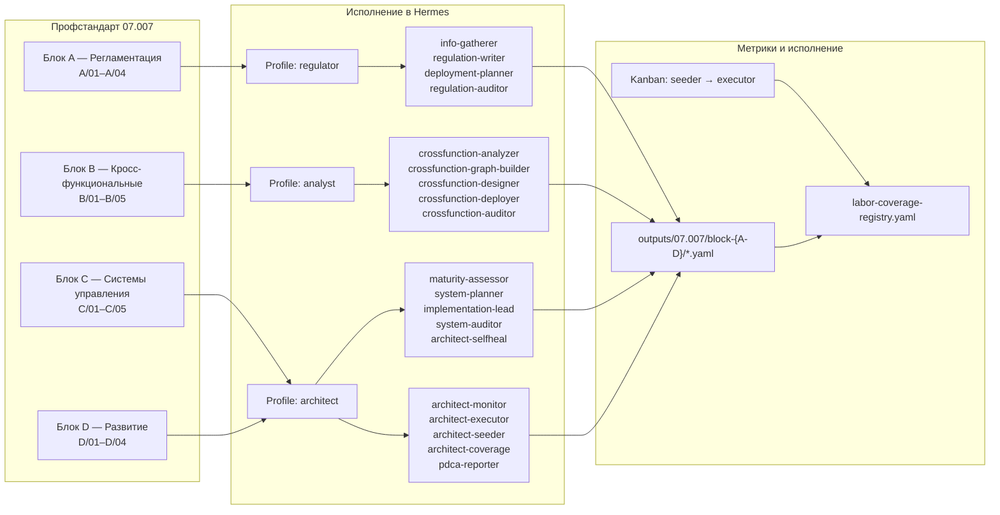

# Hermes Process Architecture

**Мультиагентная система для покрытия профстандартов навыками**

Эталонная архитектура, адаптирующая профессиональные стандарты РФ (профстандарт 07.007
«Специалист по процессному управлению») в исполняемые навыки [Hermes Agent](https://hermes.ai).
Каждая Трудовая Функция (ТФ) профстандарта покрывается специализированным навыком,
который исполняется автономно через Kanban-pipeline: `seeder → executor → навык → артефакт → registry`.

## Проблема и решение

**Проблема.** Профстандарты РФ описывают трудовые функции (ТФ), трудовые действия (ТД), умения и
знания — но это неисполняемые документы. В мультиагентных системах задачи либо выполняются вручную,
либо покрываются ad-hoc навыками без контроля покрытия и без идемпотентности. Отсутствует автономная
цепочка: «стандарт → исполняемый навык → артефакт → метрика покрытия».

**Решение.** Система конвертирует профстандарт в исполняемые навыки Hermes и оркестрирует их
исполнение через Kanban:

1. **mapping** — карта «ТФ → навык» (`labor-function-to-skill-mapping.yaml`), единый источник истины.
2. **seeder** — создаёт Kanban-DAG задач (TF-задача + цепочка ТД) на основе mapping и registry.
3. **executor** — для каждой ready-задачи находит SKILL.md, извлекает `## Process` и исполняет
   в sandbox-подпроцессе (RLIMIT CPU/память/размер файла, configurable timeout).
4. **Шаг 0 (ADR-007)** — pre-flight check идемпотентности: артефакт существует и registry
   синхронизирован → `Skipping generation`, exit 0. Повторные запуски не перезаписывают артефакты.
5. **registry** — `labor-coverage-registry.yaml`: статус покрытия каждой ТФ (covered / partially_covered),
   skill_path, артефакты, last_executed.

## Архитектура

Профстандарт 07.007 содержит 4 блока (ОТФ) и 18 трудовых функций. Каждый блок обслуживается
профилем AI-сотрудника:



## Статус покрытия

Профстандарт **07.007** (18 ТФ):

| Метрика | Значение |
|---------|----------|
| Всего ТФ | 18 |
| `covered` | 9 |
| `partially_covered` | 9 |
| `missing` | 0 |
| Записей в registry | 17 (+1 documented gap: С/05.7 — навык существует, запись появится после первого исполнения) |

```bash
python3 scripts/validate-registry.py
# → Registry valid: True
```

## Быстрый старт

Требования: Python 3.10+, `pyyaml`, локальный Hermes Agent (`hermes kanban`).

### 1. Валидация консистентности

```bash
python3 scripts/validate-registry.py
```

Проверяет: каждая ТФ со статусом covered/partially_covered имеет запись в registry,
`skill_path` совпадает с mapping, documented gaps корректны.

### 2. Автономный цикл (Kanban)

```bash
# Создать задачи для одной ТФ
python3 scripts/seed-tf-pipeline.py --tf "А/01.6"

# Исполнить ready-задачи (повторять до "No ready tasks")
python3 scripts/execute-tf-pipeline.py
```

Цепочка: TF-задача + N ТД (parent-child DAG). Executor claim → находит навык по
`body.skill_path` → исполняет `## Process` из SKILL.md → артефакт → registry update → complete.
Повторный запуск — Шаг 0 (ADR-007) пропускает генерацию без перезаписи.

### 3. Конфигурация sandbox

`config.yaml` (или env `SKILL_TIMEOUT`, `SKILL_MEMORY_LIMIT_MB` и др.):

```yaml
skill_timeout: 120
cpu_limit_sec: 120
memory_limit_mb: 512
file_size_limit_mb: 10
```

## Структура проекта

```
.
├── profiles/                  # AI-профили и их навыки
│   ├── regulator/skills/      #   блок A: info-gatherer, regulation-writer, ...
│   ├── analyst/skills/        #   блок B/C: crossfunction-*, system-*, ...
│   └── architect/skills/      #   блок C/D: architect-*, pdca-reporter, td-gen/
├── outputs/07.007/            # Артефакты исполнения + registry + mapping
│   ├── block-A..block-D/      #   артефакты по блокам
│   ├── labor-coverage-registry.yaml
│   └── block-D/labor-function-to-skill-mapping.yaml
├── docs/                      # Профстандарты, ADR, нормативная база
│   ├── standards/             #   локальные копии профстандартов
│   └── ADR/                   #   Architecture Decision Records
├── scripts/
│   ├── validate-registry.py   #   валидация mapping ↔ registry
│   ├── seed-tf-pipeline.py    #   seeder (Kanban-задачи из mapping/registry)
│   └── execute-tf-pipeline.py #   executor (исполнение навыков)
├── schemas/                   # Эталонные YAML-схемы артефактов
├── config.yaml                # Sandbox-конфигурация executor'а
└── AGENTS.md                  # Контекст проекта (для AI-агентов)
```

## Документация

- **`outputs/07.007/block-D/new-skill-architecture-blueprint.md`** — как создавать новые навыки
- **ADR** — архитектурные решения (001–007): структура файлов, профили, идемпотентность, mapping
- **`AGENTS.md`** — полный контекст проекта и процесса покрытия

## Лицензия

[MIT](LICENSE)
